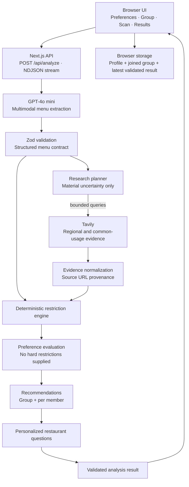

<p align="center">
  
</p>

<h1 align="center">MenuKita</h1>

<h3 align="center">Find the dishes that match everyone at the table.</h3>

<p align="center">
  Upload a menu, compare it with five different food profiles, and turn uncertain ingredients into clear questions for the restaurant.<br />
  Built as an evidence-aware, agentic food compatibility assistant for groups navigating unfamiliar menus.
</p>

<p align="center">
  <a href="https://nextjs.org/"></a>
  <a href="https://www.typescriptlang.org/"></a>
  <a href="https://platform.openai.com/docs/"></a>
  <a href="https://docs.tavily.com/"></a>
  <a href="./LICENSE"></a>
</p>

<p align="center">
  <a href="https://menu-kita.vercel.app"><strong>Live Demo</strong></a> ·
  <a href="#how-the-demo-works">Demo Flow</a> ·
  <a href="#architecture">Architecture</a> ·
  <a href="#getting-started">Getting Started</a> ·
  <a href="#test-results">Tests</a> ·
  <a href="#safety-and-evidence-boundary">Safety</a>
</p>

<p align="center">
  <strong>Repository:</strong> <a href="https://github.com/wildanniam/menu-kita">wildanniam/menu-kita</a>
</p>

---

## Project Evidence

| Deliverable | Status | Evidence |
| --- | :---: | --- |
| Live group demo | ✅ | [menu-kita.vercel.app](https://menu-kita.vercel.app) |
| Multimodal menu reading | ✅ | GPT-4o mini reads JPEG, PNG, and WebP menu images directly |
| Bounded agentic research | ✅ | Tavily research is limited to material hard-restriction uncertainty |
| Group compatibility | ✅ | Five profiles, per-dish status, group recommendation, and individual fallback |
| Personalized questions | ✅ | One restaurant question per affected member and dish; clear members get no empty prompt |
| Location-aware context | ✅ | Optional coarse location improves regional ingredient research without storing coordinates |
| Automated verification | ✅ | 87 tests across 23 test files, plus lint, type checks, and production build |
| Responsive interface | ✅ | Preferences → Group → Scan → Results on desktop and mobile |

---

## Project Overview

MenuKita helps a group answer a deceptively difficult question:

> “Which dishes can each of us actually consider ordering from this unfamiliar menu?”

A translation app can translate a dish name, but it usually does not explain common hidden ingredients, regional preparation, religious restrictions, allergies, spice tolerance, or what still needs to be confirmed with the restaurant.

MenuKita combines:

- A current user's questionnaire profile.
- Four preset group members with different dietary needs.
- Multimodal menu extraction through GPT-4o mini—without a separate OCR service.
- Bounded Tavily research for material ingredient uncertainty.
- Deterministic hard-restriction rules separated from preference scoring.
- Evidence-aware recommendations for the group and each individual.
- Personalized bilingual questions when the restaurant must confirm something.

The hackathon prototype deliberately uses one preset group. Authentication, databases, invitations, and group-sharing infrastructure are outside the MVP.

---

## Why It Matters

The idea came from an international summer camp where friends regularly had to interpret unfamiliar menus for people with different needs:

- Madhoolika follows a vegan diet.
- Harsh does not eat beef.
- Moomina has a seafood allergy.
- Victor is lactose intolerant.
- The current user may require halal food and has personal likes, dislikes, and spice tolerance.

The hard part is not simply reading the menu. The hard part is distinguishing:

1. What the restaurant explicitly listed.
2. What is commonly used in that dish or region.
3. What remains unknown and needs a direct restaurant question.

MenuKita keeps those categories separate so uncertainty is visible instead of being turned into a confident guess.

---

## How the Demo Works

1. **Create your food profile** — enter dietary requirements, allergies, preferences, dislikes, and spice tolerance.
2. **Join the preset group** — review the five profiles that will be compared with the menu.
3. **Add optional location context** — allow coarse geolocation or type a city so research can consider local ingredient usage.
4. **Scan or upload a menu** — GPT-4o mini reads the image directly and returns structured dishes.
5. **Run bounded research** — the orchestrator asks Tavily only about dishes with material hard-restriction uncertainty.
6. **Match every person** — deterministic restriction checks and AI-assisted preference evaluation produce a complete member-by-dish matrix.
7. **Inspect personalized results** — switch between members or use the `All` overview to see recommendations, evidence, uncertainty, and restaurant questions.

The live workflow streams truthful high-level stages to the browser through newline-delimited JSON. It does not display invented progress steps.

---

## Evidence Model

| Evidence type | Meaning | Example |
| --- | --- | --- |
| **Listed on the menu** | Directly visible in the uploaded menu | “The menu lists peanuts.” |
| **Common usage** | Source-backed information about typical preparation; not this restaurant's exact recipe | “Fish sauce is commonly used in this regional curry.” |
| **Still unresolved** | A material fact the menu and bounded research could not confirm | “Ask whether the frying oil is shared with meat products.” |

Compatibility wording follows the available evidence. The safe claim is:

> No known conflict was found in the available information.

MenuKita does **not** claim:

> This dish is definitely safe.

---

## Architecture



### Controlled agent pipeline

The workflow is implemented with direct TypeScript orchestration rather than LangChain:

1. Extract and validate menu data.
2. Decide which dishes have material uncertainty.
3. Research at most three dishes with at most two queries per dish.
4. Normalize only claims tied to exact returned source URLs.
5. Evaluate hard restrictions independently from preferences.
6. Build group and per-member recommendations.
7. Generate one restaurant question per affected member and dish.
8. Validate the complete result before streaming it to the client.

Provider failures degrade to unresolved evidence or deterministic fallback behavior instead of silently inventing an answer.

---

## Tech Stack

| Layer | Technology |
| --- | --- |
| Web application | Next.js 16 App Router, React 19, TypeScript 5 |
| Styling and UI | Tailwind CSS 4, Base UI, shadcn, Lucide icons, Motion |
| Multimodal AI | OpenAI Responses API with `gpt-4o-mini` |
| Web research | Tavily SDK |
| Contracts and validation | Zod 4 |
| Testing | Vitest 4 |
| Location resolution | Browser Geolocation API + server-side OpenStreetMap Nominatim proxy |
| Hosting | Vercel-compatible Next.js deployment |
| Collaboration | OpenSpec change artifacts committed with implementation |

No separate OCR service, LangChain, authentication provider, or database is used in the MVP.

---

## Product Features

### Food profiles and group mode

- Questionnaire for dietary requirements, allergies, preferences, dislikes, and spice tolerance.
- One browser-stored current user combined with four source-controlled preset members.
- Clear separation between hard restrictions and soft preferences.
- Explicit preset-group selection without authentication complexity.

### Menu understanding

- JPEG, PNG, and WebP support up to 8 MB.
- Direct visual menu reading with GPT-4o mini.
- Menu-language detection, translation, dish names, descriptions, prices, and listed ingredients.
- Zod validation plus one bounded model-repair attempt for invalid extraction.

### Evidence-aware research

- Research only when a hard-restriction decision has material uncertainty.
- Coarse optional location context for regional ingredient usage.
- Exact Tavily source URL provenance.
- Clear distinction between menu-listed facts, common usage, and unresolved evidence.
- No automatic halal-certificate lookup or assumption that every Indonesian dish is halal.

### Group results

- Table-wide recommendation when a shared option exists.
- Individual fallback recommendation for every member.
- Per-dish dietary status and separate preference score.
- Member-first result tabs plus a compact `All` overview.
- Expandable reasons, uncertainties, and evidence.
- Personalized restaurant questions scoped to one member and dish.
- Bilingual question copy action when the detected menu language is not English.

### Reliability and privacy

- Complete matrix validation and deterministic fallbacks for missing model cells.
- Five analysis attempts per client per minute on each running instance.
- 45-second OpenAI call timeout, disabled SDK retries, and 150-second workflow deadline.
- Menu images are not persisted.
- Coordinates are rounded, used only for reverse geocoding, and discarded.
- API keys remain server-only.

---

## Project Structure

```text
menu-kita/
├── openspec/changes/             # Proposals, specs, designs, and tracked tasks
├── public/
│   ├── menukita-logo-transparent.png
│   └── menukita-food-pattern.jpeg
├── src/
│   ├── app/
│   │   ├── api/analyze/          # Streaming analysis endpoint
│   │   ├── api/location/reverse/ # Coarse reverse-geocoding proxy
│   │   ├── onboarding/           # Current-user questionnaire
│   │   ├── group/                # Preset group review
│   │   ├── scan/                 # Location, image upload, and progress
│   │   └── results/              # Member and group result explorer
│   ├── components/               # Shared flow shell and UI primitives
│   └── lib/
│       ├── ai/                   # Extraction validation and repair
│       ├── analysis/             # End-to-end orchestration
│       ├── compatibility/        # Restrictions, preferences, recommendations
│       ├── data/                 # Preset demo group
│       ├── questions/            # Personalized restaurant questions
│       ├── research/             # Planning, Tavily calls, evidence normalization
│       ├── schemas/              # Shared Zod contracts
│       ├── server/               # Server-only OpenAI and Tavily adapters
│       └── storage/              # Browser profile and group state
├── AGENTS.md                     # Repository rules for coding agents
├── codex_project_context_food_compatibility_ai.md
├── design-qa.md
├── LICENSE
└── package.json
```

---

## Getting Started

### Prerequisites

- [Node.js](https://nodejs.org/) 20.9 or newer
- npm
- An [OpenAI API key](https://platform.openai.com/api-keys)
- A [Tavily API key](https://app.tavily.com/)

### 1. Clone the repository

```bash
git clone https://github.com/wildanniam/menu-kita.git
cd menu-kita
```

### 2. Install dependencies

```bash
npm install
```

### 3. Configure server-only environment variables

```bash
cp .env.example .env.local
```

Fill in:

```text
OPENAI_API_KEY=
TAVILY_API_KEY=
```

`.env` and `.env.local` are ignored by Git. Never put real credentials in `.env.example`, browser code, screenshots, issues, or OpenSpec artifacts.

### 4. Start the development server

```bash
npm run dev
```

Open [http://localhost:3000](http://localhost:3000). The root route redirects to onboarding.

---

## Available Scripts

| Command | Purpose |
| --- | --- |
| `npm run dev` | Start the Next.js development server |
| `npm run build` | Create a production build |
| `npm run start` | Serve the production build |
| `npm run lint` | Run ESLint |
| `npm run typecheck` | Run TypeScript without emitting files |
| `npm test` | Run the Vitest suite once |
| `npm run test:watch` | Run Vitest in watch mode |
| `npm run check` | Run lint, type checks, and tests |

---

## API Contract

### `POST /api/analyze`

The analysis endpoint accepts `multipart/form-data`:

| Field | Required | Description |
| --- | :---: | --- |
| `image` | Yes | JPEG, PNG, or WebP menu image, maximum 8 MB |
| `profile` | Yes | JSON questionnaire profile for the current user |
| `location` | No | Coarse city, region, and country only |

The response is an NDJSON stream containing validated stage events followed by either a validated result or a safe error record.

### `POST /api/location/reverse`

Accepts rounded coordinates, resolves a coarse place through OpenStreetMap Nominatim, and returns no coordinates. Location failure never blocks menu analysis.

---

## Test Results

The current repository includes **87 automated tests across 23 test files**.

Coverage includes:

- Menu extraction validation and repair.
- API request validation, throttling, and secret exposure.
- Research planning, provider degradation, and evidence normalization.
- Restriction precedence, preferences, and recommendations.
- Personalized restaurant-question generation and member scoping.
- Browser storage and streamed-client parsing.
- Location resolution and privacy behavior.
- Complete integration flow and shared schema contracts.

Run the standard verification suite:

```bash
npm run check
npm run build
```

---

## Deploy to Vercel

MenuKita is a Next.js application with server-side API routes.

1. Import the repository into Vercel.
2. Add `OPENAI_API_KEY` and `TAVILY_API_KEY` as encrypted project environment variables.
3. Deploy the `main` branch.

CLI deployment is also possible:

```bash
npx vercel
```

Do not expose provider keys with a `NEXT_PUBLIC_` prefix.

---

## Troubleshooting

<details>
<summary><strong>Menu analysis fails immediately</strong></summary>

Confirm that both server-only API keys exist in `.env.local`, restart the development server, and check that the image is JPEG, PNG, or WebP under 8 MB.
</details>

<details>
<summary><strong>The analysis takes a while</strong></summary>

MenuKita runs several controlled stages: multimodal extraction, optional bounded research, compatibility evaluation, recommendations, and personalized questions. Large or text-dense menu images and provider latency can increase total time.
</details>

<details>
<summary><strong>Location permission was denied</strong></summary>

Location is optional. Type a city manually or continue without it; menu scanning remains available.
</details>

<details>
<summary><strong>Results show no restaurant question for a member</strong></summary>

Questions appear only for material unresolved hard-restriction facts. A clear conflict or a sufficiently supported no-known-conflict result does not produce a redundant question. This is not a safety guarantee.
</details>

<details>
<summary><strong>An old result still uses earlier wording</strong></summary>

The latest validated result is stored in browser session storage. Scan the menu again to generate new questions with the current pipeline.
</details>

---

## Safety and Evidence Boundary

MenuKita is decision support, not a food-safety certification system.

- It cannot certify allergy safety, halal status, an exact restaurant recipe, kitchen handling, or cross-contamination.
- Missing halal certification alone is not treated as evidence that a dish is non-halal.
- Explicit pork, lard, alcohol, allergens, or other prohibited ingredients can create a hard conflict.
- Common-usage research can justify a targeted question, but it cannot prove what this restaurant uses.
- A high preference score never overrides a hard dietary conflict.
- Material uncertainty stays visible and is converted into a restaurant question.
- Users should confirm important restrictions directly with restaurant staff.

The UI deliberately uses language such as **“No known conflict found”** rather than **“Safe.”**

---

## Privacy and Secret Handling

- Uploaded menu images are processed for the current request and are not persisted by MenuKita.
- The final validated result is stored only in browser session storage.
- Browser coordinates are rounded, sent once to the reverse-geocoding proxy, and discarded.
- Coarse place context may enter research planning; raw coordinates do not enter menu analysis.
- OpenAI and Tavily credentials are read only by server-side modules.
- `.env*` files are ignored except the empty `.env.example` template.

---

## OpenSpec Collaboration

OpenSpec is the repository's mandatory collaboration and change-tracking layer. Every code, documentation, configuration, test, asset, or dependency update must belong to a named OpenSpec change before editing.

Typical workflow:

```bash
openspec list --json
openspec status --change <change-name>
openspec instructions apply --change <change-name> --json
openspec validate <change-name> --strict
```

Source-of-truth order:

1. [Project context](./codex_project_context_food_compatibility_ai.md)
2. The governing change under [`openspec/changes/`](./openspec/changes/)
3. [Repository agent rules](./AGENTS.md)
4. Implementation and tests

GitHub issues and pull requests are optional for this time-boxed hackathon, but OpenSpec tracking is not.

---

## Current MVP Scope

Included:

- Responsive English group-only demo.
- One questionnaire profile plus four preset members.
- Direct multimodal menu reading.
- Optional coarse location context.
- Bounded Tavily research.
- Evidence-aware compatibility and recommendations.
- Personalized bilingual restaurant questions.

Not included:

- Authentication or accounts.
- Database persistence.
- Group invitations or sharing.
- Automatic halal-certificate verification.
- Unlimited autonomous browsing.
- Allergy, halal, recipe, or cross-contamination guarantees.

---

## License

Released under the [MIT License](./LICENSE).

---

<p align="center">
  <strong>MenuKita</strong><br />
  Read the menu. Respect every profile. Ask when evidence is not enough.
</p>
